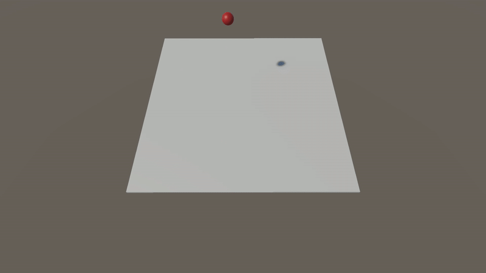
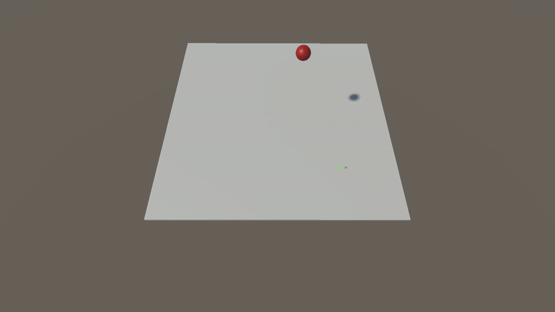
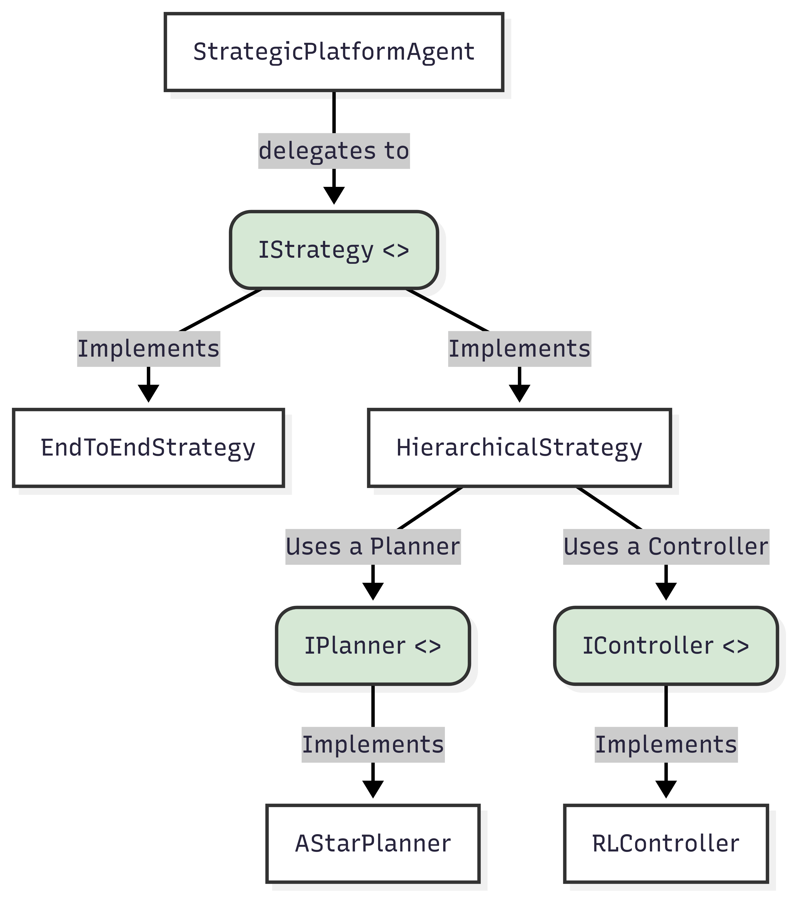
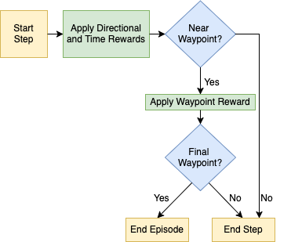
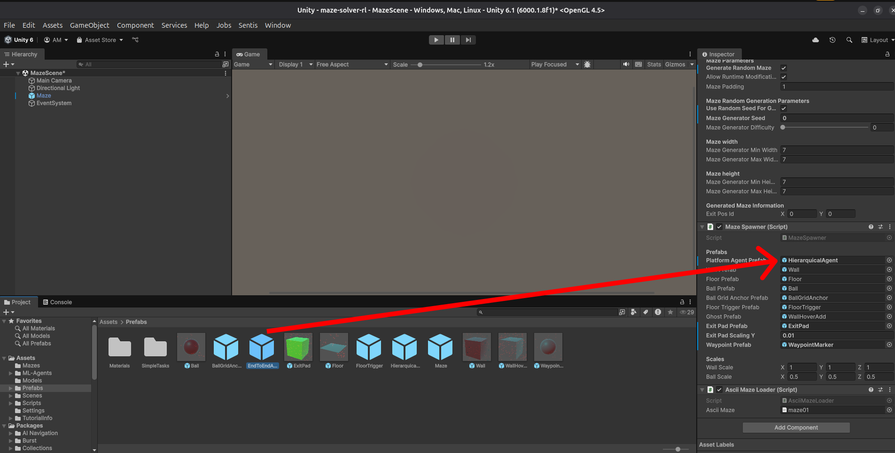

# Deep Reinforcement Learning for Maze Navigation

> **Project**
> <br />
> **Course Unit:** [Topics in Intelligent Robotics 2024/2025](https://sigarra.up.pt/feup/en/UCURR_GERAL.FICHA_UC_VIEW?pv_ocorrencia_id=542590 "Course Link")
> <br />
> **Course:** Master's in Artificial Intelligence (MIA)
> <br />
> **Faculty:** Faculty of Engineering, University of Porto
> <br />
> **[Report](docs/report.pdf)** 
> <br>
> **[Presentation](docs/presentation.pdf)** 
> <br />
---

## Project Goals

This project extends the classic ball-and-plate control problem by adding maze navigation. The goal was to develop an agent that could guide a ball through generated mazes on a tilting platform. Rather than solving just one static maze, the focus was on creating agents that could generalize across different maze configurations.

**The work progressed through three levels of complexity:**

* **Level 1 – Plate Balancing:** At this initial stage, the agent learned to control the platform to keep the ball stable and prevent it from falling off the plate.
* **Level 2 – Target Navigation:** The task became more complex as the agent was required to move the ball to a specific coordinate on the plate, demonstrating controlled directional movement.
* **Level 3 – Maze Navigation:** The final and most challenging level involved guiding the ball from a designated start point to the maze exit, navigating around walls and obstacles. We explored two main strategies for this task: a Hierarchical approach and an End-to-End approach.


<table>
  <tr>
    <td align="center">
      
      <br>
      <em>Level 1: Plate Balancing</em>
    </td>
    <td align="center">
      
      <br>
      <em>Level 2: Target Navigation</em>
    </td>
    <td align="center">
      
      <br>
      <em>Level 3: Maze Navigation</em>
    </td>
  </tr>
</table>

*Figure 1: The agent's performance across the three levels of complexity: balancing the ball (left), navigating to a target (center), and solving a complete maze (right).*
## Technical Approach

The project's architecture was designed to be modular and extensible, using a **Strategy design pattern** in C# within the Unity environment. This decouples the agent's core logic from its decision-making process, allowing for seamless switching between different algorithmic approaches. The two primary strategies implemented are `HierarchicalStrategy` and `EndToEndStrategy`. Further technical documentation and implementation details are available on the project's [deepWiki](https://deepwiki.com/Minipoloalex/maze-solver-rl).

<p style="text-align:center;">
  
  <br>
  <small>
    <em>Figure 2: Architecture implementing the Strategy pattern. The main agent delegates control, allowing it to switch between a direct EndToEndStrategy and a HierarchicalStrategy that combines an A planner with a low-level RL controller.</em>
  </small>
</p>

### Baseline Tasks: Foundational Control

Before tackling the full maze, we established baselines with simpler tasks.  For both, we used a **PPO (Proximal Policy Optimization)** agent.

1.   **Plate Balancing:** The agent's goal was simply to keep the ball on the plate. It received a small positive reward for every step the ball remained on the plate and a penalty for falling. The agent quickly learned an effective stabilization policy, achieving a near-perfect success rate.
2.   **Balance to Target:** This task required the agent to move the ball to a random target coordinate. The reward was inversely proportional to the distance to the target, encouraging the agent to get closer. The agent successfully learned to perform this goal-directed navigation.

### Hierarchical Maze Navigation

 This approach decomposes the problem into two distinct components: a high-level planner and a low-level controller. 

  *  **High-Level Planner (A\* Algorithm):** We used the classic **A\*** search algorithm as the planner (`AStarPlanner`). It operates on the discrete maze structure to compute a guaranteed optimal sequence of waypoints from the start to the exit before the agent begins to move.
  *  **Low-Level Controller (PPO Agent):** A PPO-based reinforcement learning agent (`RLController`) is responsible for the continuous control task of navigating the ball between the waypoints provided by the planner. This agent learns the complex physics-based manipulation through trial and error, focusing only on point-to-point navigation.

The agent's learning is guided by a carefully engineered multi-component reward function:
 $R\_{total} = R\_{dir} + R\_{time} + R\_{waypoint}$

  *  **Directional Reward ($R\_{dir}$):** A shaping reward calculated from the dot product of the ball's velocity and the direction to the target waypoint, encouraging movement in the correct direction. 
  *  **Dynamic Time Penalty ($R\_{time}$):** A small negative reward at each step to incentivize speed. It is scaled based on maze complexity to ensure fairness.
  *  **Waypoint Achievement Reward ($R\_{waypoint}$):** A sparse, positive reward of +1.0 is given for reaching each waypoint, providing a clear signal for sub-goal completion. 

<p style="text-align:center;">
  
  <br>
  <small>
    <em>Figure 3: Flowchart of the hierarchical reward function. Dense rewards guide the agent towards a waypoint, while a large sparse reward is given for reaching it.</em>
  </small>
</p>

### End-to-End Maze Navigation

 This strategy uses a single, monolithic reinforcement learning policy to handle the entire navigation task autonomously. 

  *  **Unified Policy:** The agent learns both high-level planning and low-level control simultaneously.
  * **Advanced Architecture:** This approach requires more sophisticated observations and a more complex network. We used:
      *  A **Convolutional Neural Network (CNN)** to process a 20x20 grid representing the local wall layout around the ball, providing the agent with "spatial vision." 
      *  A **Long Short-Term Memory (LSTM)** unit to give the agent short-term memory, enabling it to better handle the partially observable nature of the environment by tracking its movement history. 
  *  **Observations:** The agent integrates multiple data sources, including its tilt angles, velocity, the difference in grid cells to the goal, its precise position within a cell, and the distance to the goal pre-calculated using a Breadth-First Search (BFS).
  *  **Reward Function:** The reward is primarily driven by reaching the goal (+10) or failing (-1).  To guide its learning, the agent receives a continuous small negative reward based on its distance to the goal, encouraging it to make progress. 

 This approach achieved a notable success rate of 80.4% in testing. 

## Running the Code

**Setup:**

```bash
# Clone the repository
git clone https://github.com/Minipoloalex/maze-solver-rl.git
cd maze-solver-rl
```

**Prerequisites:**

  * Python 3.10.12
  * Unity Hub
  * Unity Editor 6.1

**Running the Project:**

1.  (Optional) Install the required Python packages for training new models: `pip install -r requirements.txt`.  This step is not required to run pre-trained models.
2.   Open the project in the Unity Hub using the specified Unity Editor version. 
3.  Navigate to the `Assets/Scenes` folder and select the desired scene.
4.  The project is pre-configured to run with a trained model. Press the **Play** button in the Unity Editor to start the simulation.

To switch between the **Hierarchical** and **End-to-End** strategies, select the correspondent `agent prefab GameObject` in the scene.


### Tutorial: Switching Agent Strategies

You can easily switch between the `Hierarchical` and `End-to-End` agents in the Unity Editor before running the simulation.

1.  In the **Hierarchy** window, select the `Maze` GameObject. This GameObject contains the `Maze Spawner (Script)` component.
2.  In the **Inspector** window, find the `Maze Spawner` component.
3.  Locate the **Platform Agent Prefab** field. This field determines which agent will be spawned.
4.  In the **Project** window, navigate to the `Assets/Prefabs` folder.
5.  Drag either the `HierarchicalAgent` or `EndToEndAgent` prefab from the `Assets/Prefabs` folder into the **Platform Agent Prefab** slot in the Inspector.
6.  Press **Play** to run the simulation with the selected agent.

<p style="text-align:center;">
  
  <figcaption>
    <small><em>Figure 4: To change the agent, select the <b>Maze</b> GameObject and drag the desired agent prefab (e.g., <b>HierarchicalAgent</b>) into the <b>Platform Agent Prefab</b> field of the Maze Spawner script.</em></small>
  </figcaption>
</p>

## Training & Development

### Training the Agents

This project uses the **Unity ML-Agents Toolkit** to train the reinforcement learning agents.

**1. Training Command**

After installing the Python requirements, you can start training from your terminal. The main command is `mlagents-learn`. You must point it to a configuration file and give your training run a unique ID.

```bash
mlagents-learn <config_file_path> --run-id=<your_run_id>
```

  * **`<config_file_path>`**: Path to the training configuration file. We have provided two:
      * `config/MazeTraining.yaml`: For the `Hierarchical` and `EndToEnd` maze-solving agents.
      * `config/Platform.yaml`: For the simpler `BalancePlatform` and `PlatformTarget` baseline agents.
  * **`--run-id`**: A unique name for your training run. Trained models and summaries will be saved in a `results/<your_run_id>` folder.

**2. Starting a Training Session**

1.  Open the project in the Unity Editor and load the desired scene (e.g., `MazeScene`).
2.  Open a terminal in the project's root directory.
3.  Run the training command. For example, to train the maze agents:
    ```bash
    mlagents-learn config/MazeTraining.yaml --run-id=MazeTestRun01
    ```
4.  When you see the message "Start training by pressing the Play button in the Unity Editor", press **Play** in Unity to begin.
5.  You can monitor the training progress in the terminal or by using TensorBoard: `tensorboard --logdir results`.

**3. Using the Trained Model**

1.  Once training is complete (or you stop it with `Ctrl+C`), the trained model will be saved as an `.onnx` file. You can find it at `results/<your_run_id>/<Behavior_Name>.onnx`.
      * The `Behavior_Name` is defined in the agent's `Behavior Parameters` component in Unity (e.g., `HierarchicalMazeSolver`).
2.  Copy the generated `.onnx` file into your Unity project, for example, into the `Assets/Models` folder.
3.  In the Unity Editor, select the agent prefab you want to update (e.g., `HierarchicalAgent`).
4.  In the Inspector, find the **Behavior Parameters** component.
5.  Drag your new `.onnx` model file from the Project window into the **Model** field.
6. The agent will now use your newly trained model when you run the simulation.

### Tutorial: How to Add a New Strategy

The project's Strategy Pattern makes it easy to implement and test new algorithms.

**Step 1: Create a New Strategy Class**

1.  In the Unity Project window, navigate to `Assets/Scripts/Strategies`.
2.  Create a new C\# script (e.g., `MyNewStrategy.cs`).
3.  This class must implement the `IStrategy` interface. Use the following template as a starting point:

<!-- end list -->

```csharp
// In MyNewStrategy.cs
using UnityEngine;
using Unity.MLAgents.Sensors;

[System.Serializable]
public class MyNewStrategy : IStrategy
{
    // Add public fields here to make them editable in the Inspector
    [Header("My New Strategy Settings")]
    public float myCustomParameter = 1.0f;

    private StrategicPlatformAgent _agent;

    public void Initialize(StrategicPlatformAgent agent)
    {
        _agent = agent;
        Debug.Log("MyNewStrategy Initialized!");
    }

    public void OnEpisodeBegin()
    {
        // Logic to reset the environment for your strategy
    }

    public void CollectObservations(VectorSensor sensor)
    {
        // Add observations relevant to your strategy
    }

    public void ProcessActions()
    {
        // Implement the core logic: calculate rewards, check for end conditions
    }
}
```

**Step 2: Register the New Strategy**

1.  Open the `Assets/Scripts/Agents/StrategicPlatformAgent.cs` script.

2.  Add your new strategy to the `StrategyType` enum:

    ```csharp
    public enum StrategyType
    {
        EndToEnd,
        Hierarchical,
        MyNewStrategy // Add your new strategy here
    }
    ```

3.  Open the `Assets/Scripts/Strategies/StrategyFactory.cs` script.

4.  Add a `case` to the `Create` method to instantiate your new class:

    ```csharp
    public static IStrategy Create(StrategicPlatformAgent.StrategyType type)
    {
        switch (type)
        {
            // ... existing cases
            case StrategicPlatformAgent.StrategyType.MyNewStrategy:
                return new MyNewStrategy();
            // ...
        }
    }
    ```

**Step 3: Select and Configure in Unity**

1.  Select the `StrategicPlatformAgent` prefab or the instance in your scene.
2.  In the Inspector, find the `Strategic Platform Agent (Script)` component.
3.  Use the **Selected Strategy** dropdown to choose `MyNewStrategy`.
4.  The public fields from your new strategy class (like `myCustomParameter`) will now appear in the Inspector, allowing you to configure them without changing the code.

You can now press **Play** to run the agent with your new custom logic\! If it's an RL-based strategy, you'll also need to add a new behavior configuration to the `.yaml` file for training.


## Tech Stack

Python, C\#, Unity, Unity ML-Agents, PPO

## Team

  * Adriano Machado (202105352)
  * Félix Martins (202108837)
  * Francisco da Ana (202108762)
  *  Martim Iglesias (202005380)
